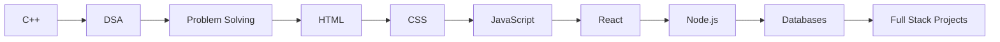

# Ayush Kumar Prajapati

<div align="center">


### Student • DSA in C++ • Full‑Stack Journey • One Commit at a Time


<p>


</p>

<a href="https://www.linkedin.com/in/ayush-kumar-prajapati-897246412/">

</a>
<a href="https://leetcode.com/u/kindaclumsy/">

</a>

</div>

---

## About Me

```cpp
class Ayush {
public:
    string role = "Student";
    string focus = "Data Structures & Algorithms";
    vector<string> languages = {"C++","HTML","CSS","JavaScript"};
    string next = "React + Backend";
    bool learning = true;
};
```

## Learning Roadmap



## Tech Stack

<p align="center">

</p>

## GitHub Dashboard

<p align="center">


</p>

<p align="center">

</p>

<p align="center">

</p>

## Featured Projects

### DSA-CPP
- Structured C++ DSA practice.
- Covers core data structures and algorithms.
- Repository: https://github.com/Ayush-apt/DSA-CPP

### JavaScript
- Learning JavaScript through hands-on examples.
- Repository: https://github.com/Ayush-apt/JavaScript

## Current Goals

- Solve DSA problems consistently.
- Build React applications.
- Learn backend development.
- Contribute to open source.
- Deploy full-stack projects.

## Contribution Snake

Create a GitHub Action to generate:

```text
output/github-contribution-grid-snake-dark.svg
```

and then use:

```html

```

## Quote

> Build fundamentals first. Speed comes later.

<div align="center">


</div>
