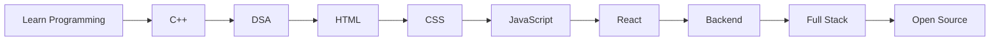

<div align="center">


# Ayush Kumar Prajapati

### Student • DSA in C++ • Full-Stack Journey • One Commit at a Time


</div>

---

# About Me

```cpp
class Ayush {
public:

    string role = "Student";

    string learning = "DSA in C++";

    vector<string> skills = {
        "HTML",
        "CSS",
        "JavaScript"
    };

    string next_goal = "Modern Web Development";

    bool stopLearning = false;
};
```

---

# Developer Journey



---

# Tech Stack

<p align="center">


</p>

---

# Currently Learning

```text
██████████████████░░░░░░░░░░░░░  C++ DSA

██████████████░░░░░░░░░░░░░░░░░  JavaScript

████████░░░░░░░░░░░░░░░░░░░░░░░  React

████░░░░░░░░░░░░░░░░░░░░░░░░░░░  Backend
```

---

# GitHub Analytics

<div align="center">


</div>

---

<div align="center">


</div>

---

# Contribution Graph


---

# Contribution Snake

> Enable GitHub Actions to generate this automatically.

<p align="center">


</p>

---

# Connect

<p align="center">

<a href="https://www.linkedin.com/in/ayush-kumar-prajapati-897246412/" target="_blank">
  
</a>

<a href="https://leetcode.com/u/kindaclumsy/" target="_blank">
  
</a>

</p>

---

# Quote

> "Great software is built one concept at a time."

---

<div align="center">


</div>
