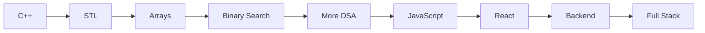

<div align="center">

# Ayush Kumar Prajapati

### Student • DSA in C++ • Future Full‑Stack Developer


<p>
<a href="https://www.linkedin.com/in/ayush-kumar-prajapati-897246412/"></a>
<a href="https://leetcode.com/u/kindaclumsy/"></a>
</p>


</div>

---

## About Me

```cpp
class Ayush {
public:
    string role = "Computer Science Student";
    string currentFocus = "DSA in C++";
    vector<string> web = {"HTML","CSS","JavaScript"};
    string next = "React -> Backend -> Full Stack";
};
```

- Learning by building projects and solving problems.
- Strengthening problem-solving through DSA.
- Documenting my journey publicly on GitHub.

---

## Learning Roadmap



---

## Tech Stack

<div align="center">

### Languages


### Tools


</div>

---

## GitHub

<div align="center">


<br>


</div>

---

## Current Learning

| Path | Progress |
|------|----------|
| C++ Fundamentals | ████████████████████ |
| Data Structures & Algorithms | ██████░░░░░░░░░░░░ (Arrays, Binary Search) |
| JavaScript | ████████████░░░░░░ |
| React | Not Started |
| Backend | Not Started |

---

## Featured Projects

### DSA-CPP
A growing collection of DSA implementations and practice in C++.

**Repository:** https://github.com/Ayush-apt/DSA-CPP

---

### JavaScript
My JavaScript learning repository containing concepts, examples, and practice code.

**Repository:** https://github.com/Ayush-apt/JavaScript

---

## Connect

<div align="center">

<a href="https://www.linkedin.com/in/ayush-kumar-prajapati-897246412/">

</a>

&nbsp;&nbsp;&nbsp;

<a href="https://leetcode.com/u/kindaclumsy/">

</a>

</div>

---

<div align="center">

> *"Consistency compounds. Keep building."*

</div>
