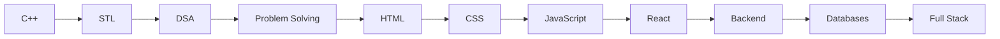

# Ayush Kumar Prajapati

<div align="center">


### Student • DSA in C++ • Full‑Stack Journey • Building Strong Fundamentals


<p>
<a href="https://www.linkedin.com/in/ayush-kumar-prajapati-897246412/"></a>
<a href="https://leetcode.com/u/kindaclumsy/"></a>
<a href="https://github.com/Ayush-apt"></a>
</p>


</div>

---

# About

```cpp
class Ayush {
public:
    string role = "Student";
    string current = "Learning DSA in C++";
    vector<string> tech = {"HTML","CSS","JavaScript"};
    string next = "React • Node.js • Databases";
    bool learning = true;
};
```

> I believe in mastering fundamentals before chasing frameworks.

---

# Learning Roadmap



---

# Tech Stack

### Languages

<p align="center">

</p>

### Tools

<p align="center">

</p>

---

# GitHub Dashboard

<p align="center">


</p>

<p align="center">

</p>

---

# Current Learning

| Topic | Status |
|---|---|
| C++ & STL | ███████████████████ |
| DSA | █████████████████░ |
| JavaScript | ██████████████░░░ |
| React | ██████░░░░░░░░░░░ |
| Backend | ███░░░░░░░░░░░░░░ |

---

# Featured Projects

## DSA-CPP

A personal knowledge base of C++ data structures, algorithms and problem solving.

- Arrays
- Strings
- Linked Lists
- Trees
- Graphs
- Dynamic Programming

Repository: https://github.com/Ayush-apt/DSA-CPP

---

## JavaScript

My JavaScript learning repository with concepts, examples and mini experiments.

- Fundamentals
- Functions
- Objects
- DOM
- Events
- Async JavaScript

Repository: https://github.com/Ayush-apt/JavaScript

---

# Goals

- Solve DSA consistently
- Build React projects
- Learn backend development
- Contribute to Open Source
- Build full-stack applications

---

# Contribution Snake

Configure a GitHub Action and use:

```html

```

---

<div align="center">

*"Build fundamentals first. The rest follows."*


</div>
